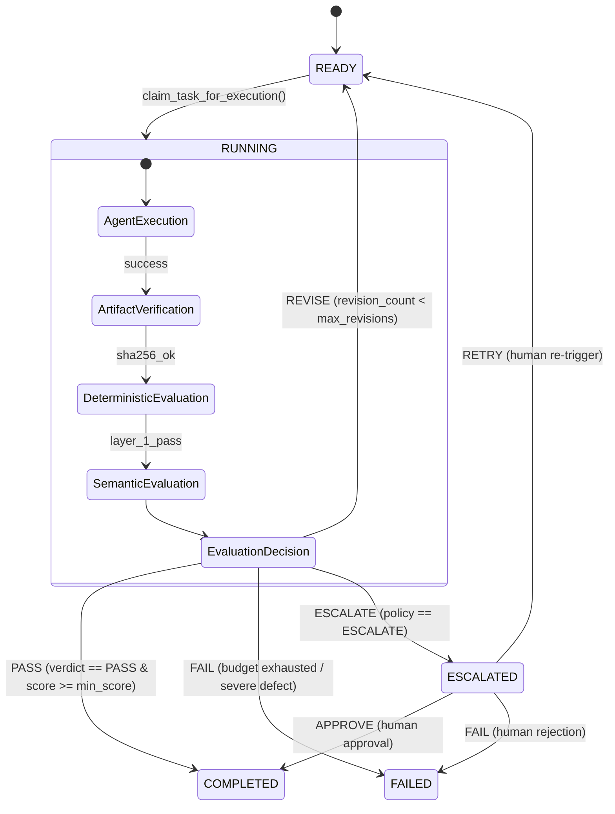

# Multi-Agent Workflow Orchestrator: Quality Evaluation & Revision Architecture

**Document:** Orchestrator Evaluation Lifecycle & Bounded Recovery Contract  
**Phase:** Phase 5 Verified Baseline  
**Status:** Complete, Hardened & Verified  

---

## 1. Overview & Core Invariants

The evaluation subsystem introduces explicit, verifiable quality gates between agent execution and downstream DAG progression. It adheres to strict architectural boundaries:

1. **Two-Layer Evaluation Hierarchy**:
   - **Layer 1 (Deterministic Rules)**: Zero-cost, instantaneous validation of output structure, required schema keys, length bounds, and prohibited terms. Fails fast without incurring model latency or token costs.
   - **Layer 2 (Semantic Quality Judge)**: Evaluates qualitative, subjective, and domain-specific criteria via `ModelProvider` structured output generation (`LLMEvaluationSchema`). Runs only if Layer 1 passes.
2. **Strict Counter Independence**:
   - `task_execution.attempt_count`: Exclusively tracks execution/infrastructure retry attempts (`max_retries`). Incremented only when claiming a task for execution.
   - `task_execution.revision_count`: Exclusively tracks quality evaluation revisions (`max_revisions`). Incremented during `TaskCommand.REVISE`.
3. **Finite & Bounded Termination**:
   - Revisions are strictly bounded by `max_revisions` (default 2, max 4). Unbounded loops are physically impossible in the state machine.
   - Global workflow timeouts apply across all evaluation and revision cycles.
4. **Downstream DAG Isolation**:
   - Upstream tasks in revision remain non-terminal. Downstream dependent tasks remain blocked in `PENDING` and cannot observe unapproved intermediate drafts.
   - Only a definitive `EvaluationVerdict.PASS` allows task completion and output propagation.

---

## 2. Evaluation Lifecycle & State Transitions

---

## 3. Verdict Semantics & Consistency Policy

| Evaluator Verdict | Score Threshold | System Action | Final Task State |
| :--- | :--- | :--- | :--- |
| `PASS` | `score >= min_pass_score` | Approved for downstream DAG consumption | `COMPLETED` |
| `PASS` | `score < min_pass_score` | Inconsistent output; overridden to `REQUIRES_REVISION` | `READY` (or `FAILED` if budget exhausted) |
| `REQUIRES_REVISION` | `score < min_pass_score` | Injects bounded `RevisionContext` and schedules revision | `READY` |
| `REQUIRES_REVISION` | `score >= min_pass_score` | Qualitative defects present; respects `REQUIRES_REVISION` | `READY` |
| `FAIL` | Any | Rejection policy executed (`FAIL` cascades unrecoverably) | `FAILED` |
| `ESCALATE` | Any | Workflow execution paused; routes to human operator | `ESCALATED` |

---

## 4. Rejection Policies

When an evaluation gate rejects an output after exhausting its revision budget (`revision_count >= max_revisions`), it enforces the task's configured `rejection_policy`:

* **`FAIL` (Default)**: Transitions the task to `TaskExecutionStatus.FAILED`. Upstream failure cascades, causing the entire workflow execution to terminate with `WorkflowExecutionStatus.FAILED`.
* **`ESCALATE`**: Transitions the task to `TaskExecutionStatus.ESCALATED`. Pauses automatic execution and notifies human operators via structured audit logs and events.

---

## 5. Security & Isolation Boundaries

1. **Vendor Isolation**:
   - Zero direct imports of `google.genai` in `execution_engine.py`, `domain/`, or `state_machine.py`. All LLM calls route through `ModelProvider`.
2. **Context Sanitization**:
   - `EvaluationRequest` contains strictly task inputs, outputs, and evaluation criteria.
   - Database sessions, API keys, credentials, and raw SQL queries never enter prompts or `RevisionContext`.
3. **Audit History Persistence**:
   - Each evaluation cycle appends structured metadata to `task_execution.evaluation_history` (verdict, score, rationale, failed checks, duration). Raw prompts and secrets are excluded.
